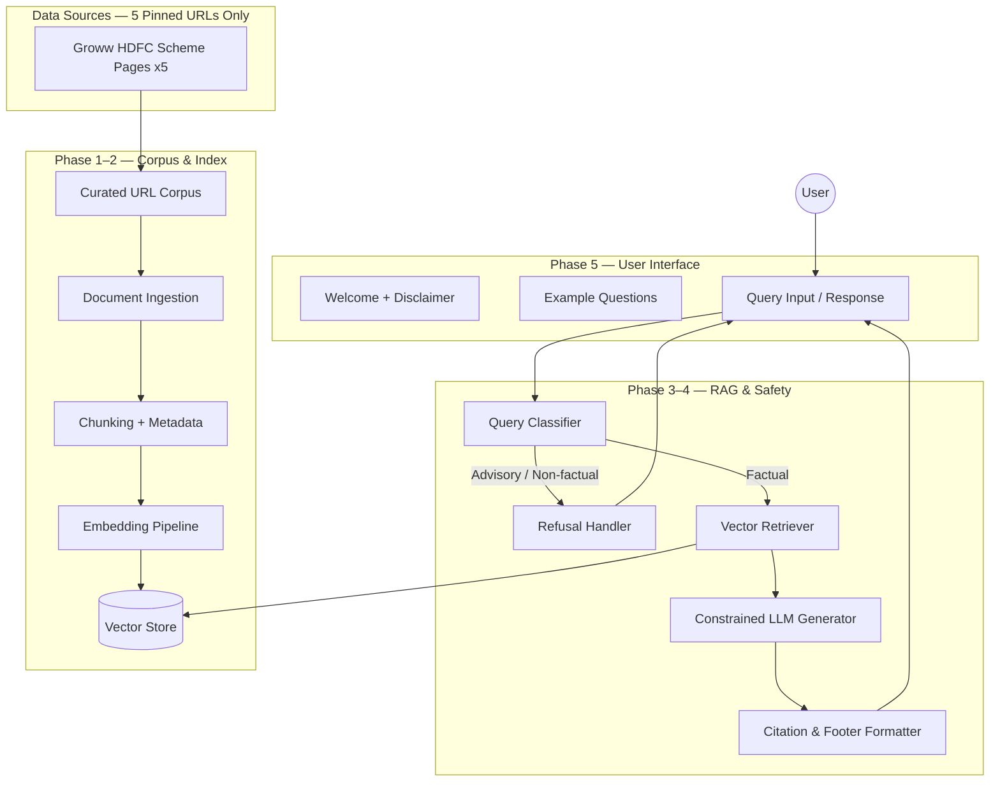
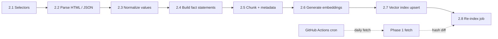
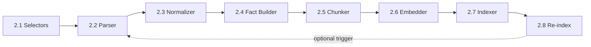
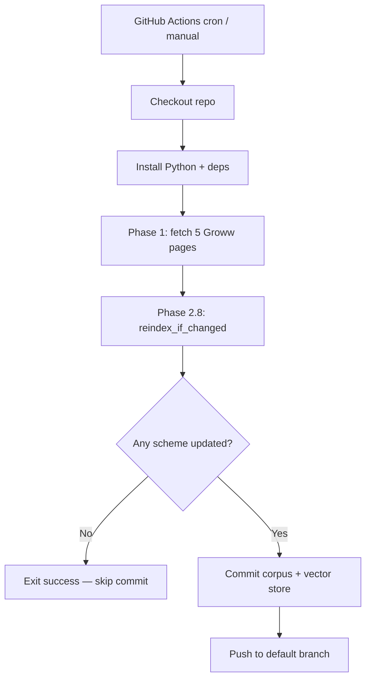
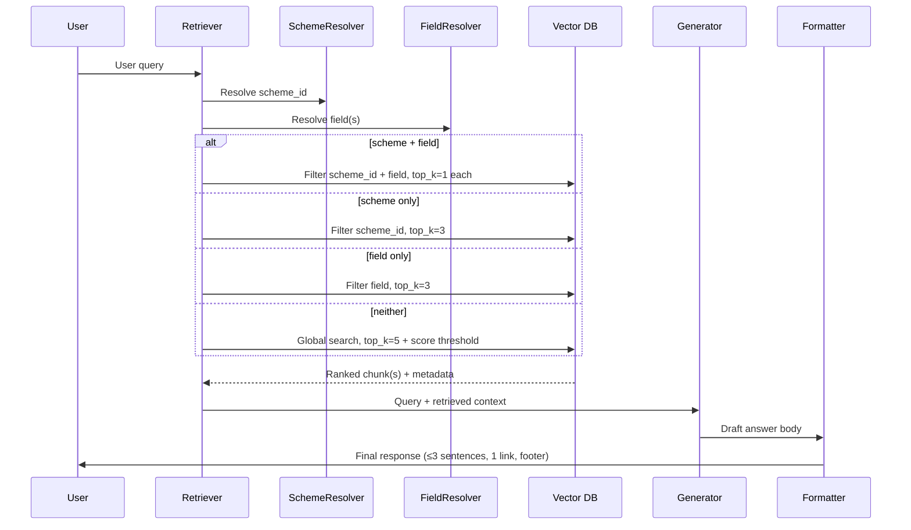
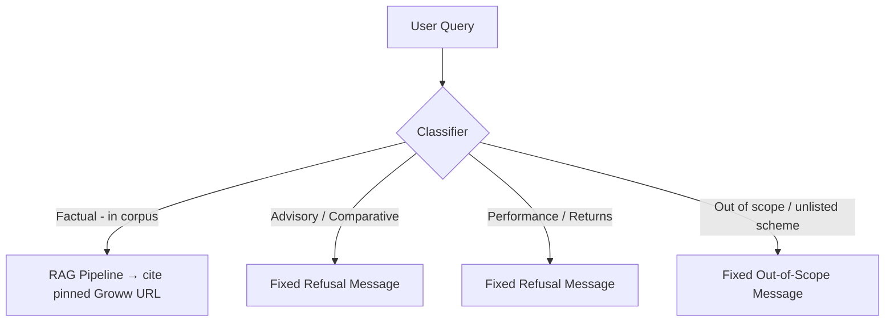
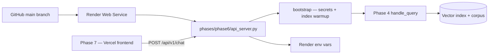
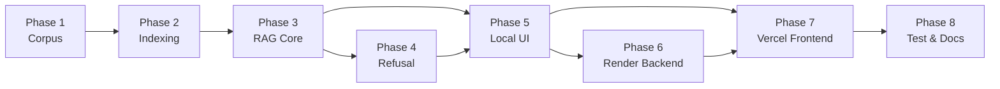

# Phase-Wise Architecture — Mutual Fund FAQ Assistant

> **AMC in scope:** HDFC Mutual Fund  
> **Reference product / data source:** [Groww](https://groww.in) scheme pages (5 HDFC schemes — see §1.4)  
> **Approach:** Lightweight Retrieval-Augmented Generation (RAG) over a curated, source-pinned corpus

---

## 1. Architecture Overview

The system is a **facts-only FAQ assistant** that answers objective, verifiable mutual fund queries by retrieving information from a curated corpus built from **five HDFC mutual fund scheme pages on Groww** (the reference product context). Every fact is pinned to its exact source URL, and the assistant never provides investment advice, opinions, or recommendations.

> **Source constraint:** The corpus is built **exclusively** from the 5 pinned Groww URLs listed in §1.4. No other URLs — including AMFI, SEBI, AMC websites, or any third-party source — are fetched, stored, or cited anywhere in the system. All refusals use a fixed, link-free message (no external links are appended).

### 1.1 High-Level System Diagram



### 1.2 Design Principles

| Principle | Implementation |
|-----------|----------------|
| Facts-only | Retrieve from official corpus; refuse advisory queries |
| Source-backed | Exactly one citation link per answer |
| Concise | Max 3 sentences per response |
| Transparent | Footer: `Last updated from sources: <date>` |
| Compliant | No PII collection; no performance comparisons |
| Lightweight | Minimal UI, simple RAG stack, no over-engineering |

### 1.3 Recommended Technology Stack

| Layer | Suggested Options |
|-------|---------------------|
| Frontend | HTML/JS (Phase 5 local); **Vercel** (Phase 7 production) |
| Backend API | FastAPI (Phase 5 local); **Render** (Phase 6 production) |
| LLM | **Groq** (`llama-3.3-70b-versatile` default) |
| Embeddings | `text-embedding-3-small` (OpenAI) or open-source equivalent |
| Vector DB | Chroma, FAISS, or Qdrant (local-first) |
| Document parsing | BeautifulSoup, PyPDF, pdfplumber |
| Orchestration | LangChain or LlamaIndex (optional) |

### 1.4 Mutual Fund Data Sources (Pinned Corpus)

The corpus is built **exclusively** from the following five HDFC scheme pages on Groww. These URLs are the canonical `source_url` values used in every citation.

| # | Scheme | Category | Source URL |
|---|--------|----------|------------|
| 1 | HDFC Mid Cap Fund — Direct Growth | Mid-cap equity | https://groww.in/mutual-funds/hdfc-mid-cap-fund-direct-growth |
| 2 | HDFC Equity Fund — Direct Growth | Flexi-cap equity | https://groww.in/mutual-funds/hdfc-equity-fund-direct-growth |
| 3 | HDFC Focused Fund — Direct Growth | Focused equity | https://groww.in/mutual-funds/hdfc-focused-fund-direct-growth |
| 4 | HDFC ELSS Tax Saver Fund — Direct Plan Growth | ELSS (tax-saving) | https://groww.in/mutual-funds/hdfc-elss-tax-saver-fund-direct-plan-growth |
| 5 | HDFC Large Cap Fund — Direct Growth | Large-cap equity | https://groww.in/mutual-funds/hdfc-large-cap-fund-direct-growth |

**Category coverage:** mid-cap, flexi-cap, focused, ELSS, and large-cap — satisfying the category-diversity requirement across a single AMC (HDFC).

#### Canonical `urls.json` (Phase 1 artifact)

```json
{
  "amc": "HDFC Mutual Fund",
  "source": "groww.in",
  "schemes": [
    {
      "id": "hdfc-mid-cap",
      "scheme_name": "HDFC Mid Cap Fund - Direct Growth",
      "category": "mid-cap",
      "plan": "Direct",
      "option": "Growth",
      "url": "https://groww.in/mutual-funds/hdfc-mid-cap-fund-direct-growth"
    },
    {
      "id": "hdfc-equity",
      "scheme_name": "HDFC Equity Fund - Direct Growth",
      "category": "flexi-cap",
      "plan": "Direct",
      "option": "Growth",
      "url": "https://groww.in/mutual-funds/hdfc-equity-fund-direct-growth"
    },
    {
      "id": "hdfc-focused",
      "scheme_name": "HDFC Focused Fund - Direct Growth",
      "category": "focused",
      "plan": "Direct",
      "option": "Growth",
      "url": "https://groww.in/mutual-funds/hdfc-focused-fund-direct-growth"
    },
    {
      "id": "hdfc-elss",
      "scheme_name": "HDFC ELSS Tax Saver Fund - Direct Plan Growth",
      "category": "elss",
      "plan": "Direct",
      "option": "Growth",
      "url": "https://groww.in/mutual-funds/hdfc-elss-tax-saver-fund-direct-plan-growth"
    },
    {
      "id": "hdfc-large-cap",
      "scheme_name": "HDFC Large Cap Fund - Direct Growth",
      "category": "large-cap",
      "plan": "Direct",
      "option": "Growth",
      "url": "https://groww.in/mutual-funds/hdfc-large-cap-fund-direct-growth"
    }
  ]
}
```

---

## 2. Phase Breakdown

### Phase 1 — Corpus Definition & Source Curation

**Goal:** Establish a trustworthy, bounded knowledge base from the five pinned HDFC scheme pages on Groww (§1.4).

#### Activities

1. **AMC selected:** HDFC Mutual Fund (single AMC, per scope).
2. **Schemes selected (5, category-diverse):**
   - HDFC Mid Cap Fund — *mid-cap*
   - HDFC Equity Fund — *flexi-cap*
   - HDFC Focused Fund — *focused*
   - HDFC ELSS Tax Saver Fund — *ELSS*
   - HDFC Large Cap Fund — *large-cap*
3. **Pin source URLs** in `urls.json` (see §1.4) — these 5 Groww URLs are the **only** URLs used anywhere in the system. No other URL is fetched, stored, or linked in any response or refusal.

#### Target Data Points (extracted per scheme page)

Each Groww scheme page is parsed for the factual fields the assistant must answer:

| Field | Example query it answers |
|-------|--------------------------|
| Expense ratio | "What is the expense ratio of HDFC Mid Cap Fund?" |
| Exit load | "What is the exit load on HDFC Focused Fund?" |
| Minimum SIP / lumpsum amount | "What is the minimum SIP for HDFC Large Cap Fund?" |
| Lock-in period | "What is the ELSS lock-in for HDFC ELSS Tax Saver?" |
| Riskometer classification | "What is the riskometer rating of HDFC Equity Fund?" |
| Benchmark index | "What benchmark does HDFC Mid Cap Fund track?" |
| Fund category / type | "Is HDFC Focused Fund an equity fund?" |
| Fund house / AMC | "Which AMC manages HDFC Large Cap Fund?" |
| NAV & AUM (snapshot, with date) | factual snapshot only — never used for return calculations |

> **Excluded by design:** trailing/CAGR returns, peer comparisons, and ratings/rankings are **not** stored as answerable facts. Performance and return queries receive a fixed refusal message — no external links are appended since no URLs outside the 5 pinned sources are used.

#### Architecture Components

```
corpus/
├── urls.json                  # Canonical pinned source URLs (§1.4)
├── metadata/
│   ├── scheme_registry.json   # Scheme id, name, category, plan, option
│   └── source_registry.json   # URL, scheme_id, last_fetched, content_hash
└── raw/
    ├── hdfc-mid-cap.html
    ├── hdfc-equity.html
    ├── hdfc-focused.html
    ├── hdfc-elss.html
    └── hdfc-large-cap.html     # Raw HTML snapshots for provenance
```

#### Source Allowlist (enforced)

```python
# Only these exact 5 URLs are permitted anywhere in the system.
# No other domain — including amfiindia.com or sebi.gov.in — is fetched or cited.
ALLOWED_URLS = [
    "https://groww.in/mutual-funds/hdfc-mid-cap-fund-direct-growth",
    "https://groww.in/mutual-funds/hdfc-equity-fund-direct-growth",
    "https://groww.in/mutual-funds/hdfc-focused-fund-direct-growth",
    "https://groww.in/mutual-funds/hdfc-elss-tax-saver-fund-direct-plan-growth",
    "https://groww.in/mutual-funds/hdfc-large-cap-fund-direct-growth",
]
```

#### Deliverables

- [ ] `urls.json` populated with the 5 HDFC/Groww scheme URLs
- [ ] `scheme_registry.json` mapping id → name, category, plan, option
- [ ] `source_registry.json` with fetch timestamps and content hashes
- [ ] Host allowlist enforced in the fetcher

#### Exit Criteria

All five URLs resolve and parse successfully; each scheme has the target data points extracted with a `source_url` and `last_updated` value; categories span mid-cap, flexi-cap, focused, ELSS, and large-cap.

---

### Phase 2 — Document Ingestion & Vector Indexing

**Goal:** Transform the five HDFC/Groww scheme pages into searchable, metadata-rich chunks stored in a vector index.

> **Implementation note:** Phase 2 is split into **subphases 2.1–2.8**, implemented one at a time under `phases/phase2/`. Phase 1 fetches raw HTML into `corpus/raw/`; Phase 2 reads those snapshots during indexing. **Fresh data** is pulled on a schedule via a GitHub Actions workflow (subphase 2.8) that re-runs Phase 1 fetch, then selectively re-parses and re-embeds only schemes whose `content_hash` changed.

#### Pipeline Architecture



#### Subphase Overview

| Subphase | Name | Input → Output | Folder artifact |
|----------|------|----------------|-----------------|
| **2.1** | Groww selectors & field map | Architecture field list → `groww_selectors.py` | `phases/phase2/groww_selectors.py` |
| **2.2** | HTML / JSON parsing | `corpus/raw/*.html` → raw extracted fields | `phases/phase2/parser.py` |
| **2.3** | Value normalization | Raw strings → typed values + display strings | `phases/phase2/normalizer.py` |
| **2.4** | Fact statement synthesis | Typed fields → natural-language fact records | `phases/phase2/fact_builder.py` |
| **2.5** | Chunking & metadata | `corpus/processed/facts.json` → `chunks.json` (+ `chunk_id`) | `phases/phase2/chunker.py` |
| **2.6** | Embedding pipeline | Chunk text → embedding vectors | `phases/phase2/embedder.py` |
| **2.7** | Vector index upsert | Chunks + vectors → searchable index | `phases/phase2/indexer.py` |
| **2.8** | Re-index job + scheduler | Phase 1 fetch → `content_hash` diff → selective re-parse & re-embed; GitHub Actions cron | `phases/phase2/reindex_job.py`, `.github/workflows/reindex-corpus.yml` |



---

#### Phase 2.1 — Groww Selectors & Field Map

**Goal:** Define the canonical list of extractable fields and centralized selector/JSON-path configuration for Groww scheme pages.

**Scope**
- Map each target data point (expense ratio, exit load, min SIP, lock-in, riskometer, benchmark, category, AMC, NAV, AUM) to JSON paths and DOM selectors.
- Declare **blocked fields** (returns, CAGR, ratings) that must never be extracted.

**Deliverables**
- [ ] `phases/phase2/groww_selectors.py` with field definitions, JSON paths, DOM labels/selectors
- [ ] `TARGET_FIELDS` and `BLOCKED_FIELDS` constants
- [ ] Unit tests with fixture HTML snippets

**Exit criteria:** Field map covers all target data points from Phase 1; blocked performance fields are explicitly listed.

---

#### Phase 2.2 — HTML / JSON Parsing

**Goal:** Read Phase 1 raw HTML snapshots and extract raw field values per scheme.

**Scope**
- Input: `corpus/raw/{scheme_id}.html` (from Phase 1)
- Layered extraction: `__NEXT_DATA__` / JSON-LD first → DOM fallback via `groww_selectors.py`
- Output: per-scheme dict of `{field: raw_string}` plus extraction status per field

**Deliverables**
- [ ] `phases/phase2/parser.py` — `parse_scheme_html(html, scheme_id) -> ParsedScheme`
- [ ] Per-field `found | missing | blocked` status in parse result
- [ ] Tests against saved `corpus/raw/` snapshots (or fixtures)

**Exit criteria:** All 5 schemes parse without error; required fields report status; no blocked field is extracted.

---

#### Phase 2.3 — Value Normalization

**Goal:** Convert raw extracted strings into typed, comparable values while preserving display strings for citation fidelity.

**Scope**
- Percentages: `"0.74%"` → `value=0.74`, `unit="%"`, `display_value="0.74%"`
- Currency: `"₹100"`, `"₹1,000"` → numeric + `INR`
- Nil/NA: `"Nil"`, `"NA"`, `"—"`, `"0%"` → canonical none/zero
- Dates: NAV/AUM snapshot dates → ISO `YYYY-MM-DD`
- Lock-in: only for ELSS; skip/N/A for other categories

**Deliverables**
- [ ] `phases/phase2/normalizer.py` — `normalize_field(field, raw_value) -> NormalizedField`
- [ ] Unit tests for edge formats (Nil, commas, en-dash, rupee symbol)

**Exit criteria:** All normalizer unit tests pass; unparseable values return `status=unparseable` without raising.

---

#### Phase 2.4 — Fact Statement Synthesis

**Goal:** Convert normalized fields into short natural-language sentences optimized for retrieval.

**Scope**
- One fact statement per `(scheme_id, field)` pair
- Attach full metadata: `scheme_id`, `scheme_name`, `scheme_category`, `amc`, `source_url`, `field`, `value`, `unit`, `last_updated`, `content_hash`
- Exclude blocked performance/return fields (enforced here as a second guard)

**Example**
```text
Raw field:  expense_ratio = "0.74%"
Fact chunk: "The expense ratio of HDFC Mid Cap Fund (Direct, Growth) is 0.74%."
Metadata:   { field: "expense_ratio", value: 0.74, unit: "%", scheme_id: "hdfc-mid-cap", source_url: "...", last_updated: "..." }
```

**Deliverables**
- [ ] `phases/phase2/fact_builder.py` — `build_facts(scheme, normalized_fields) -> list[FactRecord]`
- [ ] `corpus/processed/facts.json` (intermediate artifact, optional but recommended for debugging)
- [ ] Tests: one fact per field; correct `source_url` from `scheme_registry.json`

**Exit criteria:** Each scheme produces fact records for all found target fields; every `source_url` ∈ `ALLOWED_URLS`.

---

#### Phase 2.5 — Chunking & Metadata Attachment

**Goal:** Package Phase 2.4 fact records into index-ready chunk documents with the canonical metadata schema.

> **Corpus reality (current):** Phase 2.4 already produces `corpus/processed/facts.json` with **56 fact records** across the 5 pinned Groww schemes (11 facts each for 4 schemes, **12 for ELSS** including `lock_in_period`). Phase 2.5 does **not** re-parse HTML — it reads `facts.json` and adds `chunk_id` plus any final index metadata before embedding (2.6).

#### Corpus layout (upstream of chunking)

```
corpus/
├── urls.json                          # 5 pinned Groww URLs (Phase 1)
├── metadata/
│   ├── scheme_registry.json           # scheme id, name, category, url, aliases
│   └── source_registry.json           # content_hash, last_fetched per scheme
├── raw/
│   ├── hdfc-mid-cap.html              # Phase 1 downloaded snapshots
│   ├── hdfc-equity.html
│   ├── hdfc-focused.html
│   ├── hdfc-elss.html
│   └── hdfc-large-cap.html
└── processed/
    ├── facts.json                     # Phase 2.4 output (input to 2.5) ✅ exists
    └── chunks.json                    # Phase 2.5 output (input to 2.6)
```

#### Input → output

| Stage | Artifact | Record count (current) |
|-------|----------|------------------------|
| Phase 2.4 | `corpus/processed/facts.json` | **56** facts |
| Phase 2.5 | `corpus/processed/chunks.json` | **56** chunks (1:1 with facts, deduped) |

**Per-scheme fact counts (from live corpus)**

| `scheme_id` | Facts | Notes |
|-------------|-------|-------|
| `hdfc-mid-cap` | 11 | no `lock_in_period` (non-ELSS) |
| `hdfc-equity` | 11 | |
| `hdfc-focused` | 11 | |
| `hdfc-large-cap` | 11 | |
| `hdfc-elss` | 12 | includes `lock_in_period` |

**Fields present in `facts.json` (12 of 12 target fields across corpus)**

`expense_ratio`, `exit_load`, `minimum_sip`, `minimum_lumpsum`, `riskometer`, `benchmark`, `fund_category`, `fund_house_amc`, `nav`, `nav_date`, `aum`, `lock_in_period` (ELSS only)

**Fields never chunked:** blocked performance/return/rating fields; `lock_in_period` for non-ELSS schemes (skipped in parser, absent from facts).

#### Scope

- **Input:** `list[FactRecord]` from `corpus/processed/facts.json` (or `build_all_facts()`)
- **One chunk per fact record** — field-scoped, single sentence (`text` from Phase 2.4); no token splitting, no overlap, no marketing prose
- Assign `chunk_id` (UUID v4) per chunk
- Carry forward all `FactRecord` metadata; `last_updated` already resolved in 2.4 (prefers `nav_date` ISO value, e.g. `2026-06-24`)
- Carry forward `content_hash` from Phase 1 `source_registry.json` (per scheme snapshot)
- Deduplicate on `(scheme_id, field)` — guard against duplicate facts before write (2.4 `validate_facts()` already enforces this)

#### Chunking rules (aligned with current facts)

| Rule | Implementation |
|------|----------------|
| Granularity | Exactly 1 chunk per `(scheme_id, field)` fact in `facts.json` |
| `text` | Use `FactRecord.text` as-is (retrieval-optimized sentence from 2.4) |
| `display_value` | Preserve from `FactRecord` for citation fidelity (e.g. `0.75%`, `₹100`) |
| `value` + `unit` | Preserve typed values from normalization (e.g. `0.75` + `%`, `100.0` + `INR`) |
| `source_url` | Must be one of the 5 pinned Groww URLs from `corpus/urls.json` |
| `last_updated` | Already on each fact — NAV as-of date when available |
| Dedup key | `(scheme_id, field)` — expect **56 unique** keys in current corpus |

#### Metadata schema (per chunk)

Extends the Phase 2.4 `FactRecord` with `chunk_id`:

```json
{
  "chunk_id": "uuid",
  "text": "The expense ratio of HDFC Mid Cap Fund - Direct Growth is 0.75%.",
  "source_url": "https://groww.in/mutual-funds/hdfc-mid-cap-fund-direct-growth",
  "source": "groww.in",
  "scheme_id": "hdfc-mid-cap",
  "scheme_name": "HDFC Mid Cap Fund - Direct Growth",
  "scheme_category": "mid-cap",
  "amc": "HDFC Mutual Fund",
  "field": "expense_ratio",
  "value": 0.75,
  "unit": "%",
  "display_value": "0.75%",
  "last_updated": "2026-06-24",
  "content_hash": "sha256:1e580b04920ae32513a315a46263fea0f8791a2350cea96f3e48f38159a52820"
}
```

> **Note:** `scheme_name` uses the registry format `HDFC Mid Cap Fund - Direct Growth` (hyphen-separated plan/option), matching live `facts.json`. `last_updated` is the NAV as-of date (`nav_date` normalized to ISO), not the fetch timestamp.

#### Deliverables

- [ ] `phases/phase2/chunker.py` — `build_chunks(facts: list[FactRecord]) -> list[ChunkDocument]`
- [ ] `load_facts_json()` — read `corpus/processed/facts.json`
- [ ] `save_chunks_json()` — write `corpus/processed/chunks.json`
- [ ] Dedup guard on `(scheme_id, field)` before persist
- [ ] `validate_chunks()` — schema check, `source_url` ∈ `ALLOWED_URLS`, unique `chunk_id`

**Suggested CLI**

```bash
python -c "from phases.phase2.chunker import build_chunks_from_corpus, save_chunks_json; save_chunks_json(build_chunks_from_corpus())"
```

#### Exit criteria

- Chunk count equals fact count: **56** in current corpus (scales with re-index if Groww pages change)
- No duplicate `(scheme_id, field)` pairs
- Every `source_url` is one of the 5 pinned Groww URLs
- Every chunk has `chunk_id`, `text`, `display_value`, `field`, `scheme_id`, `last_updated`, `content_hash`
- `lock_in_period` chunk exists only for `hdfc-elss`
- No blocked/performance fields in `chunks.json`

---

#### Phase 2.6 — Embedding Pipeline

**Goal:** Generate embedding vectors for all chunk texts.

**Scope**
- Batch embed chunk `text` fields
- Configurable model (e.g. `text-embedding-3-small` or local equivalent)
- Store vectors alongside chunk metadata for indexer consumption

**Deliverables**
- [ ] `phases/phase2/embedder.py` — `embed_chunks(chunks) -> list[EmbeddedChunk]`
- [ ] Env config: `EMBEDDING_MODEL`, `EMBEDDING_API_KEY` (if cloud)
- [ ] Retry/backoff on API rate limits

**Exit criteria:** Every chunk has a vector of consistent dimension; embedding failures are logged and do not silently skip chunks.

---

#### Phase 2.7 — Vector Index Upsert

**Goal:** Persist embedded chunks in a local vector store ready for Phase 3 retrieval.

**Scope**
- Vector DB: Chroma, FAISS, or Qdrant (local-first)
- Upsert with full metadata for `scheme_id` and `field` filtering
- Index path: `data/vector_store/` (or per-phase `phases/phase2/data/vector_store/`)
- Health check: minimum chunk count before marking index ready

**Deliverables**
- [ ] `phases/phase2/indexer.py` — `upsert_index(embedded_chunks) -> IndexStats`
- [ ] `phases/phase2/run.py` — CLI chaining 2.2–2.7 (`python -m phases.phase2.run`)
- [ ] `get_index_stats()` for Phase 3 preflight

**Exit criteria:** Sample similarity queries (expense ratio, exit load, SIP min, ELSS lock-in, riskometer, benchmark) each return the correct chunk for the right scheme with matching Groww `source_url`.

---

#### Phase 2.8 — Re-index Job & Scheduled Refresh

**Goal:** Keep the corpus and vector index up to date with the latest Groww scheme pages, without re-embedding unchanged snapshots.

**Scope**
- **Scheduled fetch:** GitHub Actions runs on a cron schedule (and on manual trigger) to pull the latest HTML for all 5 pinned Groww URLs via Phase 1 (`python -m phases.phase1.run`)
- **Hash diff:** Compare Phase 1 `source_registry.json` `content_hash` values against `corpus/metadata/index_registry.json` (`scheme_content_hashes` written by Phase 2.7)
- **Selective re-index:** Re-run subphases 2.2–2.7 only for `scheme_id`s whose hash changed
- **Stale cleanup:** Delete existing chunks for a re-indexed `scheme_id` from `facts.json`, `chunks.json`, `embedded_chunks.json`, and the Chroma collection before upserting replacements
- **Skip unchanged:** If no scheme hash changed after fetch, exit successfully without re-embedding (saves API cost and CI time)
- **Persist updates:** Commit refreshed corpus artifacts and vector store to the repository when changes are detected (see workflow below)

#### Scheduler — GitHub Actions

Use a **GitHub Actions workflow** as the scheduler so the assistant always serves data from a recent Groww snapshot without manual intervention.

| Control | Recommendation |
|---------|----------------|
| Workflow file | `.github/workflows/reindex-corpus.yml` |
| Schedule | `cron: '45 3 * * *'` — daily at 09:15 IST (03:45 UTC) |
| Manual run | `workflow_dispatch` — on-demand refresh from the Actions tab |
| Triggers | `schedule` + `workflow_dispatch` only (no push-triggered re-fetch) |

**Workflow steps (high level)**



1. **Checkout** the repository (with write permissions for auto-commit).
2. **Install** dependencies from `requirements.txt`.
3. **Fetch** — `python -m phases.phase1.run` (allowlist-enforced; 5 URLs only).
4. **Re-index** — `python -m phases.phase2.reindex_job` (hash-diff selective 2.2–2.7).
5. **Commit & push** (only if diffs exist) — `corpus/raw/`, `corpus/metadata/`, `corpus/processed/`, `data/vector_store/`, and updated `index_registry.json`.

**Secrets & environment**

| Secret / variable | Purpose |
|-------------------|---------|
| `OPENAI_API_KEY` or `EMBEDDING_API_KEY` | Production embeddings in CI (`text-embedding-3-small`) |
| `GITHUB_TOKEN` (default) | Auto-commit step; use `contents: write` permission |

> **CI note:** Local/tests may use `EMBEDDING_PROVIDER=deterministic`; the scheduled workflow should use OpenAI embeddings so query vectors in Phase 3 match the indexed vectors.

**Deliverables**
- [ ] `phases/phase2/reindex_job.py` — `reindex_if_changed() -> ReindexReport`
- [ ] `corpus/metadata/index_registry.json` — last-indexed hash per `scheme_id` (seeded by Phase 2.7)
- [ ] CLI: `python -m phases.phase2.reindex_job` (also callable from the workflow)
- [ ] `.github/workflows/reindex-corpus.yml` — scheduled + manual corpus refresh pipeline

**Exit criteria**
- Unchanged pages are skipped after fetch (no re-embed, no empty commit)
- Changed page updates facts, chunks, embeddings, index, and `last_updated` (NAV date)
- Index chunk count remains consistent (56 with current field map; scales if Groww pages gain/lose fields)
- Scheduled workflow completes successfully on cron and `workflow_dispatch`

**Manual re-index (local or CI)**

```bash
# Fetch latest Groww snapshots, then selective re-index
python -m phases.phase1.run
python -m phases.phase2.reindex_job
```

---

#### Groww Page Extraction Strategy

Groww scheme pages render key facts both in the DOM and often in embedded structured data. Subphases 2.1–2.2 implement this layered approach:

1. **Structured data first:** check for embedded JSON / `__NEXT_DATA__` / JSON-LD payloads carrying scheme attributes.
2. **DOM fallback:** target labelled fields (expense ratio, exit load, min SIP, lock-in, riskometer, benchmark, NAV, AUM) via stable selectors/labels.
3. **Normalization (2.3):** parse percentages, currency (₹), and dates into typed values; keep the original display string for citation fidelity.
4. **Fact statement synthesis (2.4):** convert each field into a short natural-language sentence (good for retrieval) while retaining the structured value.

> **Robustness:** because Groww markup can change, selectors live in `groww_selectors.py` (2.1), and Phase 1 `content_hash` plus subphase 2.8 ensure re-index jobs only re-embed pages that actually changed.

#### Chunking Strategy

| Parameter | Recommendation |
|-----------|----------------|
| Input | `corpus/processed/facts.json` (56 `FactRecord` entries today) |
| Chunk granularity | One chunk per `(scheme_id, field)` fact — subphase 2.5 |
| Chunk size | N/A — single-sentence `text` per fact (no token splitting) |
| Overlap | None |
| Metadata per chunk | `chunk_id`, `text`, `display_value`, `source_url`, `scheme_id`, `scheme_name`, `scheme_category`, `amc`, `field`, `value`, `unit`, `last_updated`, `content_hash` |
| Output | `corpus/processed/chunks.json` |

#### Phase 2 Components (by subphase)

| Subphase | Module | Responsibility |
|----------|--------|----------------|
| 2.1 | `groww_selectors.py` | Field map, JSON paths, DOM selectors, blocked fields |
| 2.2 | `parser.py` | Structured-data-first extraction with DOM fallback |
| 2.3 | `normalizer.py` | Parse %, ₹, and dates into typed values; keep display strings |
| 2.4 | `fact_builder.py` | Convert normalized fields into natural-language fact records |
| 2.5 | `chunker.py` | Build `ChunkDocument` list with full metadata schema |
| 2.6 | `embedder.py` | Batch embedding generation |
| 2.7 | `indexer.py` | Upsert chunks + metadata into vector DB |
| 2.8 | `reindex_job.py` | Hash-diff selective re-parse/re-embed; invoked by GitHub Actions scheduler |
| — | `run.py` | CLI orchestrator for full 2.2–2.7 pipeline |
| — | `.github/workflows/reindex-corpus.yml` | Cron + manual scheduled fetch and re-index |

#### Phase 2 Deliverables (rollup)

- [ ] **2.1** `groww_selectors.py` with field map and blocked fields
- [ ] **2.2** Parser extracting target data points from all 5 `corpus/raw/` snapshots
- [ ] **2.3** Normalizer handling Nil, %, ₹, and date formats
- [ ] **2.4** `fact_builder.py` + `corpus/processed/facts.json` ✅ (56 facts)
- [ ] **2.5** Chunker output → `corpus/processed/chunks.json` (1:1 with facts, deduped)
- [ ] **2.6** Embedder producing vectors for all chunks
- [ ] **2.7** Populated vector index + `run.py` CLI
- [ ] **2.8** Hash-based re-index job, `index_registry.json`, and GitHub Actions scheduler workflow

#### Phase 2 Exit Criteria (rollup)

Sample queries (expense ratio, exit load, SIP minimum, ELSS lock-in, riskometer, benchmark) each retrieve the correct chunk for the right HDFC scheme with the matching Groww `source_url`. All subphases 2.1–2.8 complete; no performance/return fields in the index.

---

### Phase 3 — RAG Core (Retrieval + Generation)

**Goal:** Answer factual queries with concise, source-backed responses.

> **Corpus fit:** The index has **56 chunks** (one per `scheme_id` + `field`). This is a structured fact table, not long documents. Phase 3 uses **metadata-first retrieval** with vector search as fallback — not blind top‑k RAG.

#### Query Flow



#### Retrieval Strategy (metadata-first)

| Tier | Condition | Action | `top_k` |
|------|-----------|--------|---------|
| **1 — Exact** | `scheme_id` + `field(s)` resolved | Chroma metadata `get` (no embedding score); one chunk per field | **1** per field |
| **2 — Scheme** | `scheme_id` only | Vector search within `scheme_id` | 3 |
| **3 — Field** | `field(s)` only | Vector search within `field` | 3 |
| **4 — Global** | Neither resolved | Unfiltered vector search + min similarity score | 5 |

**Resolvers (before vector search)**

| Resolver | Module | Input → output |
|----------|--------|----------------|
| Scheme | `phases.phase1.scheme_resolver.SchemeResolver` | Query text → `scheme_id` (aliases supported) |
| Field | `phases.phase3.field_resolver` | Query text → `field` id(s) via synonym map aligned with `groww_selectors.TARGET_FIELDS` |

**Field synonym examples**

| User phrasing | `field` |
|---------------|---------|
| expense ratio, TER | `expense_ratio` |
| exit load | `exit_load` |
| minimum SIP | `minimum_sip` |
| minimum lumpsum, one-time | `minimum_lumpsum` |
| lock-in | `lock_in_period` |
| riskometer | `riskometer` |
| benchmark | `benchmark` |
| generic “minimum investment” (no SIP/lumpsum) | both `minimum_sip` + `minimum_lumpsum` |

**Not used for this corpus (MVP)**

| Approach | Reason |
|----------|--------|
| Blind top‑k (3–5) without filters | Pulls wrong field from same scheme |
| Cross-encoder reranker | Overkill for 56 chunks |
| BM25 hybrid | Chunks share templated wording; metadata wins |

#### Retrieval Configuration

| Setting | Value |
|---------|-------|
| Primary mode | Metadata-filtered retrieval (`scheme_id` + `field`) |
| `top_k` | **1** when scheme + field known; **3–5** only for fallback tiers |
| Similarity threshold | **0.25** on unfiltered / low-confidence paths (`1 / (1 + distance)`) |
| Embedding model | Same as index: `text-embedding-3-small` |
| Context passed to generator | **One primary chunk** (multi-field: same `scheme_id`, same `source_url`) |
| Reranker | Skip for MVP |

#### Generation Constraints (System Prompt)

The LLM must be instructed to:

1. Answer **only** from provided context.
2. Limit response to **maximum 3 sentences**.
3. Include **exactly one** source link (from retrieved chunk metadata).
4. Append footer: `Last updated from sources: <date>` (from chunk `last_updated`).
5. If context is insufficient or the query is out of scope, say so with a fixed polite message — do **not** link to any external page.
6. **Never** compare funds, predict returns, or give advice.

**Generator providers**

| Provider | When | Module |
|----------|------|--------|
| `template` (default offline) | Tests / no API key | `TemplateAnswerGenerator` — uses retrieved `chunk.text` |
| `groq` | Production when `GROQ_API_KEY` set | `GroqAnswerGenerator` — temperature ≈ 0 |
| `auto` | Default env | Groq if key present, else template |

Env: `GENERATOR_PROVIDER`, `GENERATOR_MODEL` (default `llama-3.3-70b-versatile`), `GROQ_API_KEY` / `GENERATOR_API_KEY`.

#### Response Template

```
<Answer in ≤3 sentences>

Source: <single pinned Groww scheme URL>

Last updated from sources: YYYY-MM-DD
```

**Worked example**

```
The expense ratio of HDFC Mid Cap Fund (Direct, Growth) is 0.74%.

Source: https://groww.in/mutual-funds/hdfc-mid-cap-fund-direct-growth

Last updated from sources: 2026-06-25
```

#### Components

| Module | Responsibility |
|--------|----------------|
| `field_resolver.py` | Map query phrases → canonical `field` id(s) |
| `retriever.py` | Tiered metadata-first retrieval + vector fallback |
| `prompt_builder.py` | System + user prompt with retrieved context |
| `generator.py` | Template or Groq answer body generation |
| `response_formatter.py` | Citation, footer, ≤3 sentences, `ALLOWED_URLS` validation |
| `pipeline.py` | `answer_query()` orchestration |
| `run.py` | CLI: `python -m phases.phase3.run "<question>"` |

#### Deliverables

- [x] End-to-end RAG pipeline (CLI)
- [x] Prompt templates with facts-only guardrails
- [x] Response validation (sentence count, single URL, grounded values)

#### Exit Criteria

Accurate answers for all sample factual queries listed in the problem statement, each with one valid citation. Retrieval uses `scheme_id` + `field` filters when resolvable; unchanged schemes are not conflated across fields.

---

### Phase 4 — Refusal Handling & Query Classification

**Goal:** Detect and politely refuse advisory, comparative, or non-factual queries.

#### Classification Categories

| Category | Example | Action |
|----------|---------|--------|
| Factual | "What is the expense ratio of HDFC Mid Cap Fund?" | RAG pipeline → cite pinned Groww URL |
| Advisory | "Should I invest in this fund?" | Fixed refusal message (no external link) |
| Comparative | "Which fund is better?" | Fixed refusal message (no external link) |
| Performance / returns | "Will this fund outperform?" | Fixed refusal message (no external link) |
| PII / account-specific | "What is my balance?" | Fixed refusal message (no external link) |
| Out of scope | Unrelated topics | Fixed refusal message (no external link) |
| Scheme not in corpus | Query about a non-HDFC or unlisted fund | Fixed out-of-scope message (no external link) |

#### Refusal Flow



#### Refusal Response Templates

**Advisory / Comparative refusal**
```
I can only answer factual questions about the five HDFC mutual fund schemes
available in this assistant. I cannot provide investment advice, recommendations,
or fund comparisons.

Facts-only. No investment advice.
```

**Performance / Returns refusal**
```
I do not provide performance data, return calculations, or projections.
I can answer factual questions such as expense ratio, exit load, minimum SIP,
lock-in period, riskometer classification, or benchmark index.

Facts-only. No investment advice.
```

**Out-of-scope / unlisted scheme refusal**
```
This assistant only covers five HDFC mutual fund schemes (Mid Cap, Equity,
Focused, ELSS Tax Saver, Large Cap — Direct Growth). I don't have information
about other funds or topics.

Facts-only. No investment advice.
```

> **No external links in any refusal.** All three templates are self-contained; no AMFI, SEBI, or any other URL is appended.

#### Implementation Options

1. **Rule-based:** Keyword patterns (`should I`, `better`, `recommend`, `buy`, `sell`).
2. **LLM classifier:** Lightweight classification call before RAG (recommended for nuance).
3. **Hybrid:** Rules for obvious cases + LLM for edge cases.

#### Components

| Module | Responsibility |
|--------|----------------|
| `query_classifier.py` | Route query to RAG, refusal, performance-refusal, or out-of-scope |
| `refusal_handler.py` | Emit fixed advisory/comparative refusal text (no external link) |
| `performance_handler.py` | Emit fixed performance/returns refusal text (no external link) |

#### Deliverables

- [x] Classifier with ≥95% accuracy on test query set
- [x] Three fixed refusal templates (advisory, performance, out-of-scope) — no external links
- [x] Scheme-in-corpus check: queries about unlisted funds return the out-of-scope message

#### Exit Criteria

All advisory, performance, and out-of-scope sample queries are refused with the correct fixed message; no external URL appears in any refusal response.

---

### Phase 5 — Minimal User Interface

**Goal:** Provide a clean, disclaimer-visible chat experience.

> **Implementation note:** Phase 5 is split into **backend first**, then **frontend**. The FastAPI backend (`phases/phase5/`) is reused in production via the Phase 6 Render wrapper (`phases/phase6/api_server.py`).

#### UI Wireframe (Logical Layout)

```
┌─────────────────────────────────────────────┐
│  Mutual Fund FAQ Assistant                  │
│  Facts-only. No investment advice.          │
├─────────────────────────────────────────────┤
│  Welcome message explaining scope           │
│                                             │
│  Try asking:                                │
│  • Expense ratio of HDFC Mid Cap Fund?      │
│  • Lock-in period of HDFC ELSS Tax Saver?   │
│  • Benchmark index of HDFC Large Cap Fund?  │
│                                             │
│  ┌─────────────────────────────────────┐    │
│  │ User query input                     │    │
│  └─────────────────────────────────────┘    │
│                                             │
│  [Response area with citation + footer]     │
└─────────────────────────────────────────────┘
```

#### UI Requirements

| Element | Requirement |
|---------|-------------|
| Welcome message | Explain facts-only scope |
| Example questions | Exactly 3 clickable examples |
| Disclaimer | Visible: **"Facts-only. No investment advice."** |
| Response display | Answer, single source link, last-updated footer |
| PII | No input fields for PAN, Aadhaar, account, OTP, email, phone |

#### API Backend (Phase 5a — implemented)

| Method | Path | Purpose |
|--------|------|---------|
| `GET` | `/health` | Liveness + vector index readiness |
| `GET` | `/api/v1/meta` | Title, welcome message, disclaimer, 3 example questions |
| `GET` | `/api/v1/disclaimer` | Disclaimer snippet |
| `POST` | `/api/v1/chat` | Classified Q&A (`Phase 4` → `Phase 3` when factual) |

Run: `python -m phases.phase5.run` — OpenAPI at `/docs`.

| Module | Responsibility |
|--------|----------------|
| `app.py` | FastAPI routes + CORS |
| `service.py` | Wraps `handle_query()`, bootstrap metadata |
| `models.py` | Pydantic request/response schemas |
| `config.py` | Welcome copy, disclaimer, example questions |
| `run.py` | Uvicorn entrypoint |

Env: `API_CORS_ORIGINS` (comma-separated frontend origins).

#### UI Components (Phase 5b — implemented)

| Module | Responsibility |
|--------|----------------|
| `frontend/index.html` | Main UI shell |
| `frontend/static/js/app.js` | Query input, example buttons, response rendering |
| `frontend/static/css/styles.css` | Disclaimer banner + layout |

Served at `GET /` by the FastAPI app.

#### Deliverables

- [x] FastAPI backend with `/health`, `/api/v1/meta`, `/api/v1/chat`
- [x] Disclaimer snippet endpoint for UI banners
- [x] Three example questions exposed via `/api/v1/meta`
- [x] Runnable UI (HTML/JS) at `http://127.0.0.1:8000/`
- [x] Example questions wired to backend via click → `POST /api/v1/chat`

#### Exit Criteria

User can ask questions via API or UI, see formatted responses, and disclaimer is always visible.

---

### Phase 6 — Backend Deployment (Render)

**Goal:** Deploy the FastAPI REST API as a hosted, always-on service on [Render](https://render.com), connected to the GitHub repository.

> **Implementation note:** Phase 6 wraps the existing Phase 5 FastAPI app (`phases/phase5/app.py`) with a bootstrap layer (`phases/phase6/bootstrap.py`) for env secrets and vector-index warmup. It does not duplicate RAG logic.

#### Scope

| Area | Detail |
|------|--------|
| Host | Render Web Service (linked to `tejas2904-RM/M2-RAGBOT`) |
| Entry | `phases/phase6/api_server.py` — ASGI app for `uvicorn` |
| Blueprint | `render.yaml` at repo root — service `m2-ragbot-api` |
| Pipeline | Same routes as Phase 5: `/health`, `/api/v1/meta`, `/api/v1/chat` |
| Corpus / index | Rebuild from `corpus/processed/embedded_chunks.json` on boot if index missing |
| Secrets | Render **Environment** variables: `GROQ_API_KEY`, `OPENAI_API_KEY`, `API_CORS_ORIGINS` |
| CORS | `API_CORS_ORIGINS` must include the Phase 7 Vercel domain |

#### Deployment architecture



#### API requirements

| Requirement | Implementation |
|-------------|----------------|
| Index readiness | `/health` returns `index_ready: true` before accepting traffic |
| Boot warmup | `init_backend()` rebuilds index from embedded chunks if needed |
| Secrets | API keys only on Render — never in repo or Vercel |
| CORS | Allow Vercel origin via `API_CORS_ORIGINS` + `*.vercel.app` regex in Phase 5 |
| Health check | Render `healthCheckPath: /health` |

#### Deliverables

- [x] `phases/phase6/api_server.py` — Render ASGI entrypoint
- [x] `phases/phase6/bootstrap.py` — secrets + index warmup
- [x] `phases/phase6/build.py` — Render build validation
- [x] `phases/phase6/config.py` — Render service constants
- [x] `render.yaml` — Render Blueprint
- [x] `phases/phase6/README.md` — deploy steps for Render
- [x] Health check: index chunk count ≥ 50 before accepting traffic

#### Deploy steps (summary)

1. Push `main` to GitHub.
2. **Render → New → Blueprint** → connect repo; confirm `render.yaml` creates `m2-ragbot-api`.
3. Set environment variables: `GROQ_API_KEY`, `OPENAI_API_KEY`, `API_CORS_ORIGINS` (Vercel URL after Phase 7).
4. Deploy; verify `GET /health` returns `index_ready: true`.
5. Copy the public API URL (e.g. `https://m2-ragbot-api.onrender.com`) for Phase 7 `API_BASE_URL`.

#### Exit criteria

- Render service is live on the public URL without startup errors.
- `GET /health` and `POST /api/v1/chat` succeed from curl/Postman.
- Factual sample query returns answer + single Groww citation + last-updated footer.
- Advisory query returns fixed refusal with no external link.
- Secrets are not present in the repository or build logs.

---

### Phase 7 — Frontend Deployment (Vercel)

**Goal:** Deploy the Phase 5 static frontend (HTML/CSS/JS) to [Vercel](https://vercel.com) as a production CDN-hosted UI that calls the Phase 6 Render API.

#### Scope

| Area | Detail |
|------|--------|
| Host | Vercel (linked to `tejas2904-RM/M2-RAGBOT`) |
| Source | `phases/phase5/frontend/` (static assets) |
| API target | Phase 6 Render FastAPI base URL (env: `API_BASE_URL`) |
| Routing | `vercel.json` — static output + SPA fallback to `index.html` |
| Build | `inject_config.mjs` writes `config.js` with `API_BASE_URL` at build time |

#### Configuration

| File / setting | Purpose |
|----------------|---------|
| `vercel.json` | Build command, output directory, rewrites |
| `API_BASE_URL` | Vercel environment variable — Render API URL from Phase 6 |
| `phases/phase7/inject_config.mjs` | Injects `window.__ENV__.API_BASE_URL` into `config.js` |
| `app.js` | `apiUrl()` reads `window.__ENV__.API_BASE_URL` for cross-origin fetch |
| Backend CORS | Phase 6 `API_CORS_ORIGINS` must include the Vercel domain |

#### Frontend build layout

```
phases/phase5/frontend/
├── index.html
├── static/
│   ├── css/styles.css
│   └── js/app.js          # fetch(apiUrl('/api/v1/chat'), ...)
└── config.js              # generated at build — window.__ENV__.API_BASE_URL
```

#### Deliverables

- [x] `vercel.json` at repo root
- [x] `phases/phase7/build.py` — validate bundle and write `config.js`
- [x] `phases/phase7/run.py` — local static preview server
- [x] `phases/phase7/config.py` — frontend paths and env constants
- [x] `phases/phase7/README.md` — Vercel deploy steps
- [x] Frontend uses configurable API base URL (not hard-coded `127.0.0.1:8000`)
- [x] Vercel project env vars documented in README
- [x] Production smoke test: meta load, example question, factual answer, refusal

#### Deploy steps (summary)

1. Complete **Phase 6** on Render and copy the API URL.
2. **Vercel → New Project** → import `tejas2904-RM/M2-RAGBOT`.
3. Add environment variable `API_BASE_URL` pointing to the Phase 6 Render URL (no trailing slash).
4. Deploy; note the production URL (`https://m2-ragbot.vercel.app` or custom domain).
5. Update Render `API_CORS_ORIGINS` with the Vercel origin and redeploy the API.

#### Exit criteria

- Vercel URL serves the dark-theme chat UI.
- `/api/v1/meta` and `/api/v1/chat` succeed from the browser (CORS OK).
- Disclaimer remains visible on every page load.
- No API keys in frontend bundle — only the public Render API URL in `config.js`.

---

### Phase 8 — Integration, Testing & Documentation

**Goal:** Validate end-to-end behavior and ship deliverables.

#### Test Matrix

| Test Type | Coverage |
|-----------|----------|
| Factual accuracy | Expense ratio, exit load, SIP min, lock-in, riskometer, benchmark |
| Citation integrity | Exactly one link; URL matches retrieved source |
| Response format | ≤3 sentences; footer present |
| Refusal | Advisory and comparative queries |
| Performance queries | Fixed refusal message; no external link |
| Privacy | No PII fields in UI or logs |
| Regression | Re-index does not break retrieval |

#### Documentation Deliverables

1. **README**
   - Setup instructions
   - Selected AMC and schemes
   - Architecture overview (link to this document)
   - Known limitations
2. **Disclaimer snippet** for UI and docs

#### Known Limitations (to document)

- Corpus freshness is maintained by the Phase 2.8 GitHub Actions workflow (daily cron + manual `workflow_dispatch`), which re-fetches the 5 pinned Groww pages and re-indexes only changed schemes
- Answers limited to the 5 HDFC schemes listed in §1.4; all other funds are out of scope
- Cannot answer account-specific or personalized queries
- No external educational or regulatory links are provided — by design

#### Exit Criteria

All success criteria from the problem statement are met:

- [ ] Accurate retrieval of factual information
- [ ] Strict facts-only adherence
- [ ] Consistent valid source citations
- [ ] Proper refusal of advisory queries
- [ ] Clean, minimal, user-friendly interface

---

## 3. End-to-End Data Flow Summary

```
5 HDFC scheme pages on Groww (§1.4) — ONLY source
        ↓
   Corpus Curation + URL Allowlist (Phase 1)
        ↓
   Fetch → Extract fields → Fact statements → Embed → Vector DB (Phase 2)
        ↓
   User Query → Classifier (Phase 4)
        ├─ Factual (in corpus)  → Retrieve (scheme_id + field) → Generate → Format (Phase 3)
        │                          → cite pinned Groww URL
        ├─ Performance / Returns → Fixed refusal message (no link)
        ├─ Advisory / Comparative → Fixed refusal message (no link)
        └─ Out of scope / unlisted → Fixed out-of-scope message (no link)
        ↓
   UI Display with Disclaimer (Phase 5 local / Phase 7 Vercel)
        ↓
   Backend API (Phase 6 Render — FastAPI)
```

---

## 4. Security, Privacy & Compliance

| Requirement | Architecture Control |
|-------------|---------------------|
| No PII | No storage fields; no logging of user inputs containing PII patterns |
| Pinned URLs only | Fetcher hard-coded to the exact 5 Groww URLs in §1.4; no other domain is ever contacted or cited |
| No external links in refusals | All refusal/out-of-scope responses use fixed text only — zero external URLs |
| No investment advice | Classifier + constrained prompts + response validation |
| No performance comparisons | Performance queries receive a fixed refusal; no calculations or links |
| Transparency | Factual answers: mandatory Groww citation + last-updated footer |
| Data minimization | Stateless queries; no user accounts in MVP |

---

## 5. Suggested Repository Structure

```
RAG-Chatbot/
├── Docs/
│   ├── ProblemStatment.md
│   └── PhaseWiseArchitecture.md      # this document
├── corpus/
│   ├── urls.json                     # 5 HDFC/Groww scheme URLs (§1.4)
│   ├── metadata/
│   │   ├── scheme_registry.json
│   │   └── source_registry.json
│   └── raw/                          # raw HTML snapshots per scheme
├── phases/
│   ├── phase1/                       # Corpus fetch + allowlist (run.py)
│   ├── phase2/                       # Ingestion 2.1–2.8 (reindex_job.py)
│   ├── phase3/                       # RAG core (retriever, generator, pipeline)
│   ├── phase4/                       # Query classification + refusals
│   ├── phase5/                       # FastAPI + local HTML/JS UI
│   ├── phase6/                       # Render backend deploy (api_server, bootstrap)
│   ├── phase7/                       # Vercel frontend deploy config & docs
│   └── phase8/                       # Integration test harness (optional)
├── render.yaml                       # Phase 6 — Render Blueprint
├── vercel.json                       # Phase 7 — Vercel static build / routing
├── .github/
│   └── workflows/
│       └── reindex-corpus.yml        # Scheduled fetch + selective re-index (Phase 2.8)
├── tests/
├── data/                              # vector store (data/vector_store/)
├── README.md
└── requirements.txt
```

---

## 6. Phase Timeline (Suggested)

| Phase | Focus | Estimated Effort |
|-------|-------|------------------|
| Phase 1 | Corpus curation | 1–2 days |
| Phase 2 | Ingestion & indexing | 2–3 days |
| Phase 3 | RAG core | 2–3 days |
| Phase 4 | Refusal & classification | 1–2 days |
| Phase 5 | Local UI + API | 1 day |
| Phase 6 | Backend deploy (Render) | 0.5–1 day |
| Phase 7 | Frontend deploy (Vercel) | 0.5–1 day |
| Phase 8 | Testing & documentation | 1–2 days |

**Total MVP:** ~10–16 days (single developer, part-time adjustable)

---

## 7. Phase Dependencies



Phases 3 and 4 can be developed in parallel after Phase 2; Phase 5 integrates both. Phases 6 and 7 deploy to production; Phase 7 depends on a public backend URL from Phase 6.

---

*Generated from `ProblemStatment.md` — Mutual Fund FAQ Assistant (Facts-Only Q&A)*
